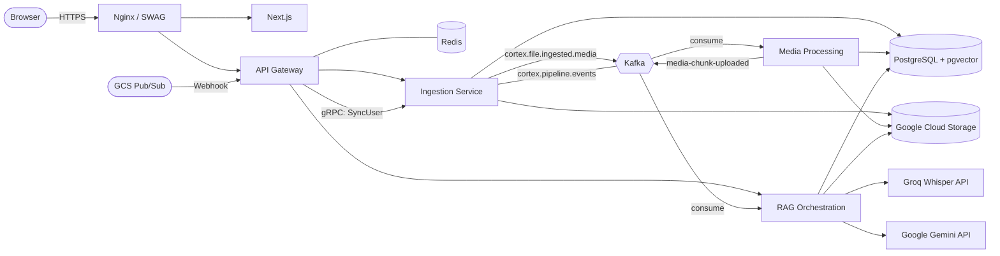

# Cortex

**[Live Demo](https://cortex-media.in)**

A media intelligence platform. Upload video or audio — Cortex automatically chunks it, transcribes the audio (Groq Whisper), analyzes the video (Gemini), generates embeddings, and indexes everything into a searchable vector database. Then search across all your media using natural language.

## Architecture

## How It Works

1. **Login** — User authenticates via Google OAuth2. On success, the Gateway syncs the user profile to the Ingestion service's `users` table via gRPC.
2. **Upload** — User selects a file. The frontend gets a signed GCS URL from the Ingestion service and uploads directly to Google Cloud Storage.
3. **Webhook** — GCS triggers a Pub/Sub notification to the Ingestion service, which marks the file as uploaded and publishes a Kafka event.
4. **Chunking** — Media Processing consumes the event, streams the file from GCS, and splits it into 60-second chunks (video `.mp4` + audio `.wav`) using FFmpeg.
5. **AI Analysis** — RAG Orchestration consumes each chunk and runs two tasks in parallel:
   - **Vision**: Sends the video chunk to Gemini for visual scene description.
   - **Transcription**: Sends the audio chunk to Groq Whisper for speech-to-text.
6. **Embedding** — The vision summary and transcript are combined and embedded into a 768-dimensional vector using Gemini Embeddings, then stored in PostgreSQL (pgvector).
7. **Search** — Users search with natural language. The query is embedded and matched against stored chunks using hybrid search (semantic + full-text) with Reciprocal Rank Fusion.

## Components

| Service | Tech | Role |
|---|---|---|
| **Frontend** | Next.js 16, React 19, Tailwind, shadcn | UI — file management, pipeline timeline (SSE), search |
| **API Gateway** | Spring Cloud Gateway, Redis, gRPC Client | OAuth2 (Google), session management, JWT relay, routing, user sync |
| **Ingestion** | Spring Boot, Kafka, GCS, gRPC Server | File metadata CRUD, user management, webhooks, SSE broadcast, pipeline event tracking |
| **Media Processing** | Spring Boot, FFmpeg, Kafka | Streams media from GCS, chunks with FFmpeg, uploads chunks back to GCS |
| **RAG Orchestration** | Spring Boot, Gemini, Groq, Spring AI | Vision analysis, transcription, embedding generation, hybrid search |
| **PostgreSQL** | pgvector | Stores users, file metadata, media chunks, embeddings, pipeline events |
| **Kafka** | Apache Kafka | Async event bus between services |
| **Redis** | Redis 8 | Gateway session store |

## Stack

- **Backend**: Java 21, Spring Boot 3.5, Spring Cloud Gateway, Spring AI, Spring Kafka, Spring gRPC
- **Frontend**: Next.js 16, React 19, TypeScript, Tailwind CSS v4, Framer Motion
- **AI**: Groq (Whisper Large v3), Google Gemini 2.5 Flash (Vision), Gemini Embeddings (768-dim)
- **Infra**: Docker Compose, Nginx (SWAG), GCS, Cloud SQL, Aiven Kafka (mTLS)
- **Deployment**: GCP e2-standard-2 VM, manual `deploy.sh`

## Current Status

- **Infrastructure migration in progress**: Moving from GCP (e2-standard-2) to Oracle Cloud. GCS, Cloud SQL, and Aiven Kafka integrations are being re-evaluated for the new environment.
